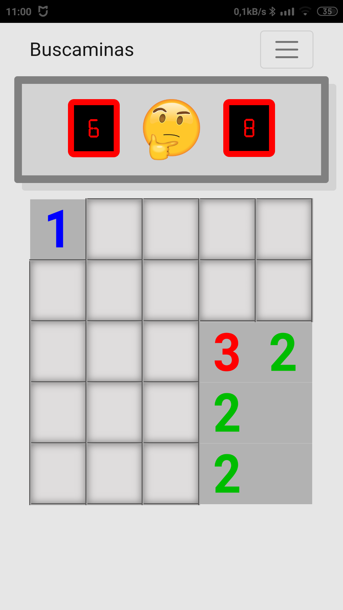
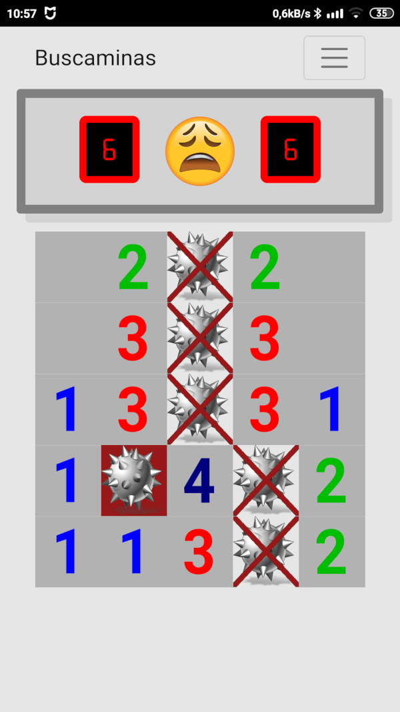

# Tutorial de introducción a HTML5, CSS3 y al pensamiento computacional con JavaScript 

## Introducción

Este curso ha sido realizado para ayudar a nuestros alumnos durante los meses de confinamiento por la pandemia del COVID-19. Primavera del 2020.

Para seguir el curso te animamos a visitar el [canal de Youtube del autor](https://www.youtube.com/user/juanguedu) además de seguir estas explicaciones.

## Cómo usar el curso

Para cada entrega (semana) vamos creando una rama nueva, de tal manera que si quieres seguir el proyecto viendo los vídeos, sólo necesitarás cambiar a la rama de la semana del vídeo.

## Índice de contenido

1. [Semana 1: HTML5 - Sintaxis básica y tablas.](./Semana1.md)
   + Ejercicio: Plantilla de una página Web con hiperenlaces.
2. [Semana 2: HTML5 - El modelo de cajas.](./Semana2.md)
3. [Semana 3: CSS3 - Con un poco de estilo. Menús.](./Semana3.md)
   + Ejercicio horario de clase.
4. [Semana 4: JavaScript - ¡Hola Mundo!](./Semana4.md)
5. [Semana 5: JavaScript - Variables, clases, métodos y funciones.](./Semana5.md)
   + Ejercicio: Adivina en qué número pienso.
6. [Semana 6: JavaScript - El árbol DOM.](./Semana6.md)
7. [Semana 7: JavaScript - Pensamiento computacional. Algoritmos.](./Semana7.md)
   + Ejercicio: La letra del DNI.
8. [Semana 8: JavaScript - Almacenando datos.](./Semana8.md)

## Objetivo

Al terminar el curso, habrás aprendido cómo funciona HTML5, CSS3 y algo de JavaScript y habrás generado un juego como éste:

 
