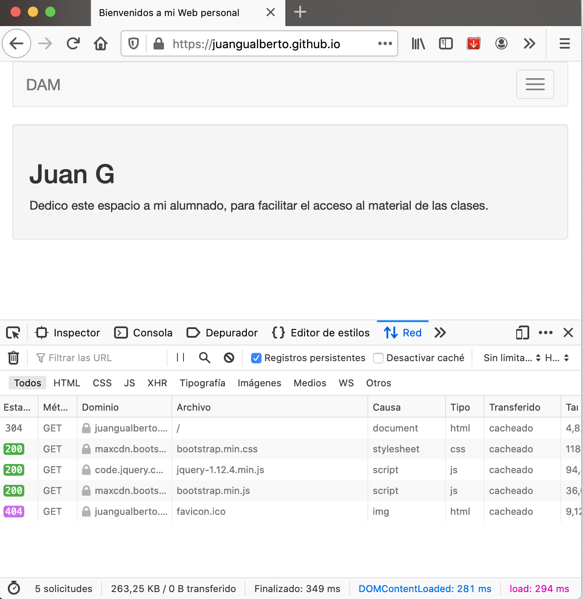

# Semana 2: HTML5 - El modelo de cajas

Antes de comenzar con el modelo de cajas vamos a ver cómo se organizan los archivos de una página Web.

Una página Web se organiza en archivos (realmente HTTP lo llama objetos). Cuando hacemos una pedición HTTP (nuestro  navegador en nuestro PC llama al servidor Web en el equipo remoto donde está hospedada la página) no sólo nos descargamos texto, también puede haber imágenes, sonidos, vídeo...

Fíjate en esta petición (hemos activado el modo "Desarrollador Web" del navegador para que se vea la consola que tienes debajo):



Yo he visitado una página, pero sin embargo se han completado 5 solicitudes (mira en la esquina inferior izquierda). Para ver esa página hemos descargado 5 objetos: el fichero HTML, la hoja de estilo BootStrap, el JavaScript jQuery, el JavaScript BootStrap y el icono de la página Web o "favicon" (éste ha dado error 404, no lo ha encontrado).

Como puedes observar, por sencilla que sea una Web, siempre tendremos varios archivos, luego **es importante organizar el contenido en carpetas** para que quede todo bien **ordenado**.

Un ejemplo de organización podría ser éste (muy importante, intenta **siempre** que estén todos los nobres de archivos y carpetas **en minúsculas**):

* el fichero index.html en la carpeta raíz de la página
* todas las fotos e imágenes en la carpeta **img**
* las hojas de estilo (para dar formato, colores, espaciado) al texto en la carpeta **css**
* el código JavaScript para dinamizar en la carpeta **js**


## Ejercicio semana 2

Deberás crear todas las carpetas necesarias para ir haciendo la Web (css, js, img, snd...).

Hay que crear el fichero index.html con el siguiente contenido:

```html
<!DOCTYPE html>
<html lang="es">
    <head>
        <meta charset="utf-8">
        <meta name="viewport" content="width=device-width, initial-scale=1.0">
        <meta name="author" content="Juan Gualberto">
        <meta name="copyright" content="GNU GPLv3">
        <title>Buscaminas</title>
    </head>
    <body>
        <nav>
            <!-- Aquí irá el menú superior -->
        </nav>
        <section>
            <!-- Aquí irán las vias, las minas y el smiley -->
        </section>
        <section>
            <!-- Aquí estará el tablero de juego -->
        </section>
            <aside>
                <!-- Esto no será necesario y lo borraremos -->
            </aside>
        </section>
        <footer>
            <!-- Aquí irá información adicional en el pié -->
        </footer>
    </body>
</html>
```
