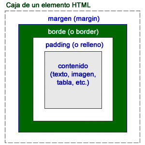

# Semana 2: HTML5 - El modelo de cajas

Antes de comenzar con el modelo de cajas vamos a ver cómo se organizan los archivos de una página Web.

Una página Web se organiza en archivos (realmente HTTP lo llama objetos). Cuando hacemos una pedición HTTP (nuestro  navegador en nuestro PC llama al servidor Web en el equipo remoto donde está hospedada la página) no sólo nos descargamos texto, también puede haber imágenes, sonidos, vídeo...

Fíjate en esta petición (hemos activado el modo "Desarrollador Web" del navegador para que se vea la consola que tienes debajo):


Yo he visitado una página, pero sin embargo se han completado 5 solicitudes (mira en la esquina inferior izquierda). Para ver esa página hemos descargado 5 objetos: el fichero HTML, la hoja de estilo BootStrap, el JavaScript jQuery, el JavaScript BootStrap y el icono de la página Web o "favicon" (éste ha dado error 404, no lo ha encontrado).

Como puedes observar, por sencilla que sea una Web, siempre tendremos varios archivos, luego **es importante organizar el contenido en carpetas** para que quede todo bien **ordenado**.

Un ejemplo de organización podría ser éste (muy importante, intenta **siempre** que estén todos los nobres de archivos y carpetas **en minúsculas**):

* el fichero index.html en la carpeta raíz de la página
* todas las fotos e imágenes en la carpeta **img**
* las hojas de estilo (para dar formato, colores, espaciado) al texto en la carpeta **css**
* el código JavaScript para dinamizar en la carpeta **js**


## La etiqueta \<div>

Cada elemento HTML que podemos encontrar en una página web se encuentra rodeado de una caja con varias propiedades que pueden ser modificadas. Es lo que llamamos el modelo de cajas.



Estas opciones nos proporcionan un gran control sobre cómo debe situarse cada elemento.

### Altura y anchura de una caja

Cada elemento HTML de una página web cuenta con una anchura y una altura específica. En muchos casos esas dimensiones se las proporciona el propio contenido, como en un párrafo o una imagen, por ejemplo. Esos valores de anchura (width) y de altura (height) pueden ser modificados mediante las hojas de estilo, gracias a las propiedades del mismo nombre.

Así podemos hacer párrafos más estrechos, imágenes que se sobredimensionen o simplemente ajustar diferentes bloques, para que se acomoden correctamente en la pantalla.

Los valores width y height se acompañan de un valor numérico exacto o de un porcentaje, como en otras muchas propiedades.

```css
body {
principal { width: 400px;
background-color: rgb(0, 126, 0);
}
```

### Margen

Comenzaremos con la imagen. Con tan sólo modificar su margen, observaremos cómo se distancia del resto de los elementos. Usaremos la propiedad margin seguida de un valor numérico o de un porcentaje:

```css
img { margin: 20px; }
```

### Relleno

Probaremos ahora a modificar su relleno, es decir, la distancia imaginaria entre un hipotético borde y la imagen propiamente dicha. Para ello emplearemos la propiedad padding, exactamente igual que hicimos con la anterior. Probemos con un valor menos exagerado:

```css
img { padding: 5px; }
```

### Borde

Si recargamos la página con esta incorporación, observaremos que, en efecto, la imagen se separa un poco más, esos 5 píxeles por cada lado, pero no es posible distinguir dónde acaba el efecto del margen y comienza el del relleno. Para poder diferenciar los valores, deberíamos tener un borde en la imagen.


```css
img {
border-width: 2px;
border-style: solid;
border-color: #007000;
}
```

Con los conocimientos que tenemos ya de CSS podemos intuir con facilidad qué es lo que hace cada una de esas tres propiedades: en una definimos el grosor del borde, en otra el tipo de línea y en la última su color.

### Laterales

Tanto margin, como padding y border se pueden emplear para modificar laterales de una caja, con independencia de los demás. Añadiendo a cada uno de ellos la variación -left (izquierda), -right (derecha), -top (arriba) o -bottom (abajo) conseguimos que sólo afecte al valor o valores indicados.

En la figura hemos aplicado estas propiedades para el título de la página:


```css
h1 {
margin-top:40px;
padding-left: 5px;
padding-right:5px;
border-top-width: 2px;
border-top-style: dotted;
border-top-color: #007000;
border-bottom-width: 2px;
border-bottom-style: double;
border-bottom-color: #007000;
}
```

### Más opciones para los bordes

Para los bordes podemos definir tres propiedades: su anchura, su estilo y su color. La anchura y el color se definen con las medidas habituales y los sistemas que ya hemos analizado. El estilo, por su parte, se basa en una serie de valores concretos:

```css
dotted: punteado.
dashed: línea discontinua.
solid: línea continua.
double: línea doble.
groove: tipo de relieve.
ridge: tipo de relieve.
inset: tipo de relieve.
outset: tipo de relieve.
none: empleado para indicar que no habrá borde
```

Es cuestión de probar algunos modelos. El valor solid es la línea sencilla, la más empleada.

Como ya sucedía con otras propiedades, podemos reagrupar los valores referidos a los bordes en una sola propiedad genérica denominada border. Para ello estableceremos los valores separados por espacios y en el orden de tamaño, estilo y color, como en este ejemplo que haría la misma función que el recuadro anterior:

```css
img { border: 2px solid #007000;}
```

### Esquinas redondeadas

Con los estilos actuales podemos trazar un borde alrededor de una figura y que tenga sus esquinas redondeadas.

La propiedad que lo permite es border-radius, acompañada de un valor numérico. El ejemplo anterior, con la incorporación de esta propiedad, daría como resultado el rectángulo de la figura:

```css
img {
border: 2px solid #007000;
border-radius:25px;
}
```

### Sombras

Las modernas hojas de estilo proporcionan a cualquier elemento la capacidad de proyectar una sombra. Ya vimos que esto funcionaba con el texto, pero además contamos con la propiedad box-shadow para crear sombras en cualquier caja de nuestra página web, lo que hace que sea posible aplicarselo a cualquier elemento.

table {box-shadow: 8px 8px 6px #aaaaaa; }

Los valores que conforman la sombra son similares a los que vimos para las sombras de texto, es decir, desplazamiento horizontal, vertical, difuminado y color de sombra.

### Elementos flotantes

Los elementos de una página web pueden reubicarse a la izquierda o a la derecha con tan sólo emplear la propiedad float, haciendo que el resto del contenido se sitúe alrededor de ese elemento.

En el siguiente ejemplo la regla:

```css
img { float:left;}
```

provoca que el texto se sitúe alrededor de la imagen.

## Ejercicio semana 2

Deberás crear todas las carpetas necesarias para ir haciendo la Web (css, js, img, snd...).

Hay que crear el fichero index.html con el siguiente contenido:

```html
<!DOCTYPE html>
<html lang="es">
    <head>
        <meta charset="utf-8">
        <meta name="viewport" content="width=device-width, initial-scale=1.0">
        <meta name="author" content="Juan Gualberto">
        <meta name="copyright" content="GNU GPLv3">
        <title>Buscaminas</title>
    </head>
    <body>
        <nav>
            <!-- Aquí irá el menú superior -->
        </nav>
        <section>
            <!-- Aquí irán las vias, las minas y el smiley -->
        </section>
        <section>
            <!-- Aquí estará el tablero de juego -->
        </section>
            <aside>
                <!-- Esto no será necesario y lo borraremos -->
            </aside>
        </section>
        <footer>
            <!-- Aquí irá información adicional en el pié -->
        </footer>
    </body>
</html>
```
