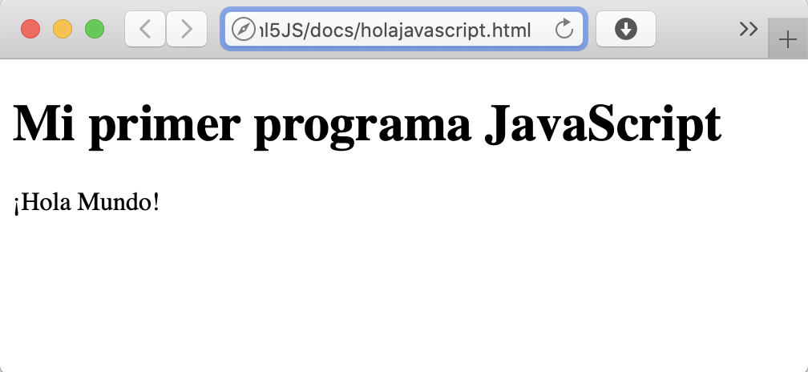
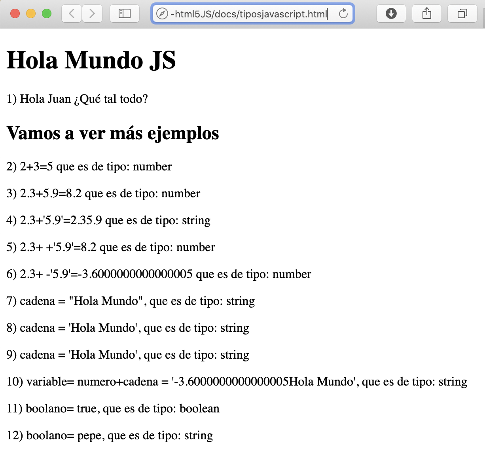

<div style="page-break-after: always; visibility: hidden; display:none"> 
\pagebreak 
</div>

# Semana 4: JavaScript - ¡Hola Mundo!

JavaScript es uno de los [lenguajes de programación más populares y usados mundialmente](http://pypl.github.io/PYPL.html), además puede funcionar dentro de un navegador insertado en una página Web, lo que para nosotros lo hace muy atractivo. Sólo con un editor de texto sencillo (notepad, geany, vi...) y un navegador Web ya tenemos todo lo necesario para comenzar a ver resultados.

## El desarrollo de aplicaciones

Crear aplicaciones para la Web, para móviles, ordenadores u otros dispositivos es un arte que, además de dotes de creatividad, requiere conocimientos de muchas disciplinas, como son:

* **Programación**: Cómo dar instrucciones al móvil o PC para que haga lo que quieres
* **Estructuras de datos**: Cómo almacenar, gestionar y manipular datos del mundo real en un programa
* **Ingeniería del software**: Nos ayuda a decidir los pasos a seguir en proyectos medianos y grandes
* **Algorítmica**: Resolver problemas reales con ayuda de la informática
* **Sistemas operativos**: Son el corazón de nuestros móviles y ordenadores. Nos proporcionan una interfaz amigable para interactuar con el hardware
* **Redes y comunicaciones**: Qué sería de nuestra vida hoy día sin estar conectados...
* **Bases de datos**: Los grandes almacenes de información
  
Y todo esto sin tener en cuenta las últimas tendencias en [ciencia de datos (data science)](https://towardsdatascience.com/data-science/home), [inteligencia artifical (IA)](https://www.bbvaopenmind.com/articulos/el-futuro-de-la-ia-hacia-inteligencias-artificiales-realmente-inteligentes/) o [grandes volúmenes de datos (big data)](https://searchdatacenter.techtarget.com/es/definicion/Big-data) o el [internet de las cosas (IoT)](https://www2.deloitte.com/es/es/pages/technology/articles/IoT-internet-of-things.html). Te animamos a explorar los enlaces anteriores para ir tomando conciencia del vasto universo de las ciencias de la computación.

## Primeros pasos

La primera manera que veremos de insertar código JavaScript en HTML es usando la etiqueta \<script> \</script> y escribiendo dentro el código del programa que queramos correr.

Crea un archivo llamado **holajavascript.html** en tu editor favorito. Genera un esqueleto html5 y añade en el \<body> el siguiente código JavaScript entre etiquetas \<script> para que quede así:

```html
<!DOCTYPE html>
<html lang="en">
<head>
    <meta charset="UTF-8">
    <meta name="viewport" content="width=device-width, initial-scale=1.0">
    <title>Document</title>
</head>
<body>
    <h1>Mi primer programa JavaScript</h1>
    <script>
        document.write("<p>¡Hola Mundo!</p>");
    </script>
</body>
</html>
```

Guarda el archivo y ábrelo en un navegador. Deberías ver algo como en la imagen.



Concretamente fíjate en la línea [^holamundo]

```javascript
document.write("<p>Hola Mundo</p>");
```

esto es código JavaScript, es una instrucción o sentencia en este lenguaje. Las instrucciones las daremos con **palabras reservadas** especiales. Lo mismo que en HTML tenemos etiquetas que significan algo (ej. \<html>, \<head>, \<body>, \<p>, \<h1>), en JavaScript (y en general en cualquier lenguaje de programación) hay una serie de palabras que el ordenador traducirá a intrucciones e intentará llevar a cabo la tarea que con ellas le hemos encomendado.

[^holamundo]: Si ya conoces JavaScript seguramente estarás pensando que esto podría ser más sencillo con un comando **console.log()**, pero para no liar más al lector con el modo desarrollo y la consola del navegador de momento usaremos esta opción aunque es peligroso escribir directamente en el árbol DOM.

Otra manera de cargar código JavaScript es en un fichero externo, para lo cual usaremos el atributo **src**; en el siguiente ejemplo nuestro código JavaScript estará en el fichero **index.js** que está en la carpeta o directorio **js**:

```html
<script src="js/index.js">
```

Por norma general esta será la manera preferente de hacerlo.

Pero, ¿qué ocurre si el navegador no soporta JavaScript o el usuario lo tiene desactivado? Para eso tenemos la etiqueta \<noscript> con la que podemos informar al usuario qe debe activar JavaScript o actualizar su navegador para poder ver el contenido de nuestra página:

```html
<noscript>
    <p>Esta página necesita JavaScript que tenga habilitado.</p> 
</noscript>
```

## Sintaxis básica

### Identificadores

Un identificador es el nombre que le podemos dar a:

* *una variable*: una variable es un pequeño espacio de la memoria del ordenador donde vamos a guardar un dato, una información concreta. Por ejemplo, si te digo que sumes 3 y 4 y que uses tus manos, tu mano derecha es una variable que ahora mismo almacena el dato 3 y tu mano izquierda es otra variable que guarda temporalmente el 4 hasta que finalmente haces la suma y devuelves 7. En un ordenador se pueden guardar tantas *manos* que hay que ponerles nombres...
* *una función*: creamos funciones para automatizar operaciones que repetimos contínuamente. Imagina que quieres aplicar un descuento del X% al precio de un producto, tendrás que restar al precio inicial el resultado de multiplicar dicho precio inicial por el descuento y dividido por cien. Si esto tengo que hacerlo para muchos precios voy a tener que escribir mucho. Si creo una función sólo tengo que llamar a la función, por ejemplo *descuento(200)* y hará a 200 el descuento predeterminado.
* *una propiedad*: Imagina los descuentos de antes. Una propiedad (ya veremos más adelante cómo se hace) sería el valor del descuento. Cambiando la propiedad *descuento*, obtendré diferentes resultados.
* *un argumento de función*: En el ejemplo de los descuentos, cuando llamábamos la función *descuento(200)*, ese **200** será un argumento, un parámetro que le paso a la función (igual que en matemáticas).

### JS es sensible a mayúsculas/minúsculas

JavaScript es sensible a mayúsculas y minúsculas (en inglés *case sensitive*) lo que quiere decir que no es lo mismo escribir *unavariable* que *unaVariable*. Hay que tener mucho cuidado en no bailar letras ni cambiar mayúsculas por minúsculas (y viceversa).

### Comentarios

Un comentario es una serie de palabras o líneas en el programa que no deben ejecutarse, simplemente están ahí para facilitar la vida del/la programador/a.

Pueden ser de una sóla línea o multilínea.

```java
 // esto es un comentario de una línea

 /*
 Esto es un
 comentario que
 ocupa más de
 una línea.
 */
```

### Instrucciones o sentencias y bloques

Las instrucciones o sentencias en JavaScript **deben terminar siempre en punto y coma**, aunque se puede omitir y se tomará como siguiente instrucción la siguiente línea, pero esto puede dar lugar a reultados inesperados y no deberíamos hacerlo.

Ejemplo:

```java
let a = 3; // definimos la variable "a" y guardamos en ella un 3
let b = 4; // definimos la variable "b" y guardamos en ella un 4
let suma = a+b; // definimos la variable "suma" y guardamos en ella un 7
```

En el ejemplo anterior hemos creado tres sentencias. Si quisiéramos agrupar sentencias en un bloque, usaremos las llaves: **{** y **}**. Ejemplo:

```java
let test=true;
if ( test ) {
    test = false;
    console.log("Ahora test vale:"+test);
}
```

En el ejemplo anterior, si la variable *test* es verdadera (que lo es), entonces se ejecuta el bloque completo (las dos líneas que hay debajo de la condición). Aquí ya empezamos a ver palabras reservadas y que las variables pueden ser de varios tipos.

| Palabras | reservadas | en | JavaScript |
| --- | --- | --- | --- |
| await | do | import | throw |
| break | else | in | try |
| case | enum | instanceof | typeof |
| catch | export  | interface | var |
| class | extends | let | void |
| const | finally | new | while |
| continue | for | return | with |
| debugger | function | super | yield |
| default | if | switch | |
| delete | implements | this| |

[Fuente: Lista de palabras reservadas en JavaScript. Mozilla.](https://developer.mozilla.org/es/docs/Web/JavaScript/Referencia/Palabras_Reservadas)

Las variables pueden ser definidas de tres maneras:

* con **var**, ejemplo: *var saludo='hola'* , la variable saludo guarda la cadena de caracteres *hola*.
* con **let**: define variables a nivel de bloque. Es la que te recomendamos usar en vez de *var*.
* con **const**: define una variable con un valor que no vamos a cambiar, es decir, una constante.
* sin poner nada: aunque se puede hacer, no es recomendable.

### Tipos de datos

Copia y pega el siguiente código JavaScript en tu editor favorito. Llama al fichero [tiposjavascript.html](docs/tiposjavascript.html) y guárdalo. Vamos a aprender los tipos de datos **number** (para números de cualquier tipo), **string** (cadenas de caracteres) y **boolean** (para booleanos: verdadero/falso). Fíjate en las operaciones matemáticas, en que hay diferentes tipos de datos...

```html
<!DOCTYPE html>
<html>
<head>
    <meta charset="utf-8">
    <meta http-equiv="X-UA-Compatible" content="IE=edge">
    <title>Probando JS</title>
    <meta name="description" content="">
    <meta name="viewport" content="width=device-width, initial-scale=1">
    <script src="js/index.js">
    </script>
</head>
<body>
    <h1> Hola Mundo JS </h1>
    <!-- Comentario HTML -->
    <script>
        /* Comentario JavaScript */
        /* llamada bloqueante. JS es no bloqueante salvo esto */
        let nombre = prompt("Dime tu nombre:");
         // esto imprime un párrafo donde nos saluda
        document.write("<p>1) Hola "+nombre+" ¿Qué tal todo?</p>");
    </script>
    <h2> Vamos a ver más ejemplos </h2>
    <script>
        // VARIABLES TIPO NÚMERO
        let numero = 2 + 3;
        document.write("<p>2) 2+3=" + numero + " que es de tipo: " + typeof(numero) + "</p>");
        numero = 2.3 + 5.9;
        document.write("<p>3) 2.3+5.9=" + numero + " que es de tipo: " + typeof(numero) + "</p>");
        numero = 2.3 + "5.9";
        document.write("<p>4) 2.3+'5.9'=" + numero + " que es de tipo: " + typeof(numero) + "</p>");
        numero = 2.3 + +'5.9';
        document.write("<p>5) 2.3+ +'5.9'=" + numero + " que es de tipo: " + typeof(numero) + "</p>");
        numero = 2.3 + -'5.9';
        document.write("<p>6) 2.3+ -'5.9'=" + numero + " que es de tipo: " + typeof(numero) + "</p>");
        // VARIABLES TIPO CADENA DE CARACTERES
        let cadena = "Hola";
        cadena += " Mundo";
        // se pueden anidar unas comillas dobles dentro de simples y viceversa
        document.write('<p>7) cadena = "' + cadena + '", que es de tipo: ' + typeof(cadena) + '</p>');
        document.write("<p>8) cadena = '" + cadena + "', que es de tipo: " + typeof(cadena) + "</p>");
        document.write('<p>9) cadena = \'' + cadena + '\', que es de tipo: ' + typeof(cadena) + '</p>');
        let variable = numero + cadena;
        document.write('<p>10) variable= numero+cadena = \'' + variable + '\', que es de tipo: ' + typeof(variable) + '</p>');
        // BOOLEANOS verdadero/falso
        let booleano = true;
        document.write("<p>11) boolano= " + booleano + ", que es de tipo: " + typeof(booleano)+ '</p>');
        booleano = "pepe";
        document.write("<p>12) boolano= " + booleano + ", que es de tipo: " + typeof(booleano)+ '</p>');
    </script>
</body>
</html>
```

¿Lo has probado? Debería verse algo como en la figura en tu navegador (tras contestar a la pregunta).



Ahora fíjate en la figura e intenta responder a las siguientes cuestiones :

1. ¿Para qué sirve la función *prompt()*?
2. ¿Qué tipo de dato usa JavaScript para los números enteros?
3. ¿Qué tipo de dato se usa para números decimales?
4. ¿Qué ocurre si ponemos entre comillas un número? ¿En qué se convierte? Ya no suma ahora, ¿qué ha pasado con los números?
5. ¿Qué le ocurre a una cadena de caracteres si le ponemos delante un símbolo más? (ojo, sólo si la cadena contiene números en el texto)
6. ¿Y si le ponemos un símbolo negativo?
7. ¿Qué pasa si ponemos comillas dobles dentro de comillas simples?
8. ¿Qué pasa si ponemos comillas simples dentro de comillas dobles?
9. ¿Te has fijado en cómo ahora pone comillas simples dentro de comillas simples? Eso se llama **escapar** las comillas (usando un carácter de escape, en este caso la barra invertida)
10. ¿Se pueden mezclar números con cadenas de caracteres? ¿Qué es el resultado final?
11. Los booleanos, la lógica, son muy importantes en programación
12. Aunque hemos definido una variable con otro tipo, al asignar se puede cambiar el tipo. Esto es muy peligroso

Operadores de comparación:

No es lo mismo el comparador estricto (=== ó !==) que el regular (== ó !=). ¡Cuidado con los cambios de tipo!

```javascript
// OPERADORES de COMPARACIÓN
var numero1 = 5;
var numero2 = '5';

document.write('numero1=5, numero2="5" ');

// COMPARACION REGULARES
var resultado = numero1 >= numero2;
document.write('<br>');
document.write('numero1 >= numero2 = ' + resultado);

resultado = numero1 <= numero2;
document.write('<br>');
document.write('numero1 <= numero2 = ' + resultado);

resultado = numero1 == numero2;
document.write('<br>');
document.write('numero1 == numero2 = ' + resultado);

resultado = numero1 != numero2;
document.write('<br>');
document.write('numero1 != numero2 = ' + resultado);

// COMPARACIÓN ESTRICTA 
var resultado = numero1 >= numero2;
document.write('<br>');
document.write('numero1 >= numero2 = ' + resultado);

resultado = numero1 <= numero2;
document.write('<br>');
document.write('numero1 <= numero2 = ' + resultado);

resultado = numero1 === numero2;
document.write('<br>');
document.write('numero1 === numero2 = ' + resultado);

resultado = numero1 !== numero2;
document.write('<br>');
document.write('numero1 !== numero2 = ' + resultado);
```

Conversiones de tipos de datos: Usamos parseInt() y parseFloat(). Cuidado que no redondean, sólo truncan (cortan) el resultado.

```javascript
// EJEMPLO DE CONVERSION: "PARSEINT"
numero2 = '5.2 enanitos de blancanieves';
document.write('<br>numero1=' + numero1 + ', numero2="' + numero2 + '" ');
resultado = numero1 === parseInt(numero2);
document.write('<br>');
document.write('Usando parseInt (sólo coge los primeros enteros que encuentra) <br>');
document.write('numero1 === parseInt(numero2) = ' + resultado);

resultado = numero1 !== parseInt(numero2);
document.write('<br>');
document.write('numero1 !== parseInt(numero2) = ' + resultado);


// Introducción a ESTRUCTURA DE CONTROL if
document.write("<h1>Estructura de control IF-ELSE</h1>");
var dato1 = parseInt(prompt('Dame un número:'));
var dato2 = parseInt(prompt('Dame otro número:'));

if (isNaN(dato1) || isNaN(dato2)) {
    document.write('Eso no era un número<br>');
} else {
    if (dato1 <= dato2) {
        document.write('El primero es menor o igual que el segundo<br>');
    } else
    if (dato1 >= dato2) {
        document.write('El primero es mayor o igual que el segundo<br>');
    } else {
        document.write('Ninguno de los casos<br>');
    }
}
```

## Estructuras de control

### Condicionales if-else

Si la expresión que hay entre paréntesis es cierta se ejecuta el código que hay entre los paréntesis (bloque), si existe un "else" y la condición es falsa, se ejecutará el código del segundo bloque.

```java
let edad = prompt('Dime tu edad');
if (edad<18) {
    document.write('<p>Eres menor de edad</p>');
} else {
    document.write('<p>Eres un adulto</p>')
}
```

### Switch..case...break

La estructura de control **switch** nos ayuda cuando tenemos múltiples opciones a evaluar. Por ejemplo, cuando llamas a un servicio de atención telefónica nos dice la locución: pulse 1 para compras, pulse 2 para ventas, pulse 3 para administración, etc. ¿Cómo se programa esto? Así:

```javascript
let dato = 0;
switch (dato) {
  case -1:
    console.log('uno negativo');
    break;
  case 0: // foo es 0, por lo tanto se cumple la condición y se ejecutara el siguiente bloque
    console.log('cero')
    // NOTA: el "break" olvidado debería estar aquí
  case 1: // No hay sentencia "break" en el 'case 0:', por lo tanto este caso también será ejecutado
    console.log('uno');
    break; // Al encontrar un "break", no será ejecutado el 'case 2:'
  case 2:
    console.log('dos');
    break;
  default:
    console.log('default');
}
```

### Bucle for

Bucle **for**: Repetimos un bloque de código tantas veces como indicamos en la variable *i* indicamos, en este caso la longitud del array (en el siguiente tema veremos qué son) Ejemplo:

```java
let semana = ["Lunes", "Martes", "Miércoles", "Jueves", "Viernes", "Sábado", "Domingo"];

document.write('<h1> Los días de la semana (bucle FOR..OF) </h1>');
console.log('Los días de la semana son:');
document.write('<br>');
for (let i=0; i<semana.length; i++) {
    document.write("<p>" + semana[i] + "</p>");+
    console.log(semana[i]);
}
document.write('<br>');
```

Bucle **for..of**: para cada elemento de un objeto especial que llamamos *iterable* repetimos tantas veces como elementos (una por cada elemento) de dicho objeto iterable. Ejemplo:

```java
let semana = ["Lunes", "Martes", "Miércoles", "Jueves", "Viernes", "Sábado", "Domingo"];

document.write('<h1> Los días de la semana (bucle FOR..OF) </h1>');
console.log('Los días de la semana son:');

document.write('<br>');
for (let dia of semana) {
    document.write("<p>" + dia + "</p>");+
    console.log(dia);
}
document.write('<br>');
```

Bucle **for..in**: Para un conjunto de atributos y su propiedad repetimos tantas veces como elementos tiene el conjunto. Ejemplo:

```java
let semana = {l:"Monday", m:"Tuesday", x:"Wednesday", j:"Thursday", v:"Friday", s:"Saturday", d:"Sunday"};

document.write('<h1> Los días de la semana (bucle FOR) </h1>');
console.log('Los días de la semana son:');

document.write('<br>');
for (let dia in semana) {
    document.write("<p>" + dia + " = " + semana[dia] + "</p>");
    console.log(dia);
}
document.write('<br>');
```

### Bucle while

Repite un bloque de código mientras la condición sea cierta. Puede ser que nunca lo sea, que nunca entremos. Ejemplo:

```java
let countdown = 10;
document.write("<p> Empieza la cuenta atrás: </p>");
while(countdown>0) {
    countdown = countdown - 1;
    document.write("<p> Empieza la cuenta atrás: </p>");
}
```

### Bucle do..while

Repite un bloque de código mientras la condición sea cierta. Como mínimo se repite una vez. Ejemplo:

```java
let countdown = 10;
document.write("<p> Empieza la cuenta atrás: </p>");
do {
    countdown = countdown - 1;
    document.write("<p> Empieza la cuenta atrás: </p>");
}while(countdown>0) ;
```

## Ejercicio tablas de multiplicar

Hacer un programa que pregunte por un número del 1 al 10 (recuerda el ejemplo de la edad con el **if**). Guárdalo en una variable que vas a usar después para mostrar la tabla de multiplicar de ese número, usando para ello la estructura de control **for** (recuerda el ejemplo del primer *for* y los días de la semana).

Puedes mostrar la salida (document.write) en la página o en la consola (console.log).

## Ejercicios resueltos y videotutorial de la semana

En [Codepen.io](https://codepen.io/juangu/pen/rNOZrvZ) tenéis los ejercicios resueltos.

En [Youtube](https://youtu.be/h4oaSMk2sVI) está el tutorial de la semana.

[](https://youtu.be/h4oaSMk2sVI)
