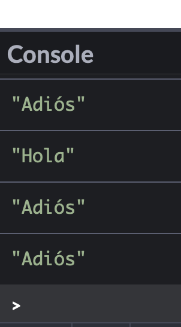

<div style="display:none"> 
\pagebreak 
</div>

# Semana 5: JavaScript - Variables, clases, métodos y funciones

En esta semana vamos a aprender un poco más sobre variables, clases, métodos y funciones.

Conceptos clave:

1. **variable**: una zona de meoria donde almacenamos información de manera temporal. Se pueden definir usando *var*, *let* o *const*. Échale un ojo al apartado de los ámbitos para más información.
2. **objeto**: un objeto es una versión ampliada de una variable, es la representación interna en el ordenador de la información referente a algo que existe en el mundo real.
3. **función**: al igual que una sentencia o intrucción podría ser la mínima unidad de cómputo, una función debería ser una serie de bloques de código que engloban siempre las mismas instrucciones pero a los que podemos dar diferentes valores y así obtener diferentes resultados (ojo, las instrucciones o sentencias son siempre las mismas).
4. **clase**: De momento basta con que pensemos que será el esqueleto o patrón con el que vamos a crear objetos.
5. **método**: Para comunicarnos con los objetos, les pasamos mensajes. Para enviar o recibir un mensaje de un objeto, usaremos métodos.

## Introducción

### Ámbito de una variable

Podemos definir una variable con *var*, *let* y *const*. El último básicamente se usa cuando no vamos a cambiar el valor almacenado nunca, ejemplo:

```javascript
const pi = 3.14159
```

Ahora bien, no es lo mismo usar *var* que *let*: **var** declara una variable de ámbito global o local para la función sin importar el ámbito de bloque, además permite levantamiento o hoisting ; **let** declara una variable de ámbito global o local para la función o de bloque, es reasignable y *no* permite hoisting; **const** declara una variable de ámbito global, local para la función o de bloque; no es reasignable, pero es mutable y no permite hoisting.

| definición | ámbito | cambios | hoisting |
| --- | --- | --- | --- |
| var  | global, bloque y subloques  |   | sí  |
| let  | global, bloque y subloques  |   | sí  |
| const  | global, bloque y subloques  |   | no  |

```javascript
function test() {
    let saludo = "hola"; // local variable
}
test();
console.log(saludo); // ¡error!
```

En el código anterior, la variable *saludo* sólo existen dentro de la función test (fíjate cómo está dentro de unas llaves, de un bloque). La variable *saludo* sólo existirá dentro del bloque donde fue definida y, de haber subbloques dentro, también ahí (salvo que creemos otra que se llame igual).

```javascript
function comprueba1(booleano){
    let saludo = "Hola";
    if(booleano) {
        let saludo = "Adiós";
        console.log(saludo);
    }
    console.log(saludo);
}

function comprueba2(booleano){
    var saludo = "Hola";
    if(booleano) {
        var saludo = "Adiós";
        console.log(saludo);
    }
}

comprueba1(true);
comprueba2(true);
```

En la función *comprueba1()* dentro del *if* definimos una nueva variable que no afecta para nada a la anterior. Sin embargo en *comprueba2()* como está definido con **var** cuando dentro del *if* queremos definir una nueva variable, no es así, estamos machacando la anterior *saludo*.



> En JavaScript, las declaraciones (de variables o funciones) se mueven al principio de su ámbito. Este comportamiento se conoce como lecantamiento o hoisting y es muy importante tenerlo en cuenta a la hora de programar para prevenir posibles errores.
> 
> Teniendo en cuenta cómo funciona el hoisting, podemos llamar a una función y definirla más abajo, porque automáticamente JS la “subirá”.

### Listas


### Diccionarios

## Ejemplo de función: creando el tablero de juego

## Ejercicio: Adivina en qué número pienso


